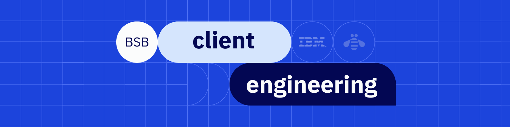

<p align="center">
  
</p>

## Sobre

A equipe de **IBM Client Engineering Brasília** cria apresentações, demos e experiências de storytelling usando **tecnologias web** em vez de ferramentas tradicionais de slides.

Sem `.pptx`. Com versionamento, responsividade e interatividade.

---

## Por Que Apresentações Web?

| Slides tradicionais   | Stack web             |
| --------------------- | --------------------- |
| Estáticos            | Interativos           |
| Arquivos binários    | Versionamento com Git |
| Layouts fixos         | Responsivos           |
| Animações limitadas | CSS e JS              |

---

## Padrões

### Tipografia

Use sempre **IBM Plex**.

```bash
npm install @ibm/plex
```

### Design System

Os projetos seguem o **Carbon Design System**.

```bash
npm install @carbon/react @carbon/styles
```

## Cores IBM

### Azul

| Amostra                                                         | Token   | Hex         |
| --------------------------------------------------------------- | ------- | ----------- |
|  | Azul 60 | `#0f62fe` |
|  | Azul 50 | `#4589ff` |
|  | Azul 30 | `#a6c8ff` |

### Cinza

| Amostra                                                         | Token     | Hex         |
| --------------------------------------------------------------- | --------- | ----------- |
|  | Cinza 100 | `#161616` |
|  | Cinza 80  | `#393939` |
|  | Cinza 10  | `#f4f4f4` |

### Alertas

| Amostra                                                         | Token     | Hex         |
| --------------------------------------------------------------- | --------- | ----------- |
|  | Sucesso   | `#24a148` |
|  | Perigo    | `#da1e28` |
|  | Atenção | `#ff832b` |

---

## Presentation Factory

O **Presentation Factory** versiona briefs, templates, assets de clientes e
associações de modelos no Git, criando pacotes de apresentação HTML
reprodutíveis sem dependências locais de máquina.

- [Leia a documentação completa](https://github.com/ce-bsb/presentation-factory/wiki)
- [Acesse o Presentation Factory](https://github.com/ce-bsb/presentation-factory)
- [Veja templates e assets de clientes](https://github.com/ce-bsb/presentation-factory/tree/main/clients)
- [Veja o catálogo de modelos](https://github.com/ce-bsb/presentation-factory/blob/main/catalog/models.toml)

---

## Como Contribuir

```bash
git clone https://github.com/ce-bsb/presentation-factory.git

git checkout -b feat/new-deck
```

Abra um Pull Request com screenshots.

---

## Recursos

- [Carbon Design System](https://carbondesignsystem.com)
- [IBM Design Language](https://www.ibm.com/design/language)
- [IBM Plex](https://www.ibm.com/plex)

---

<div align="center">
