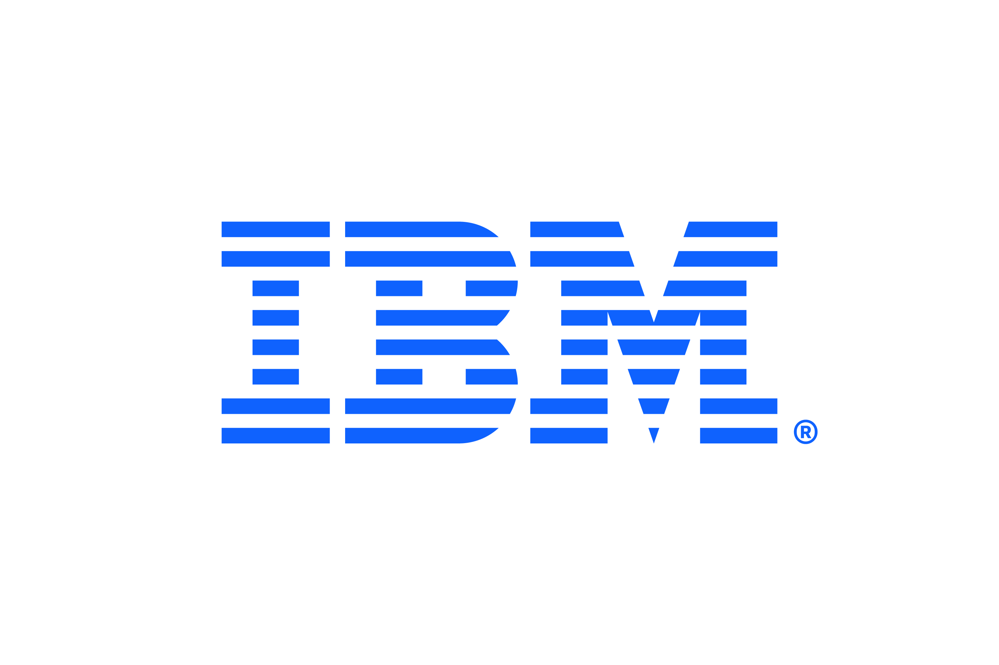

<div align="center">



<br>


# IBM Client Engineering Brasília

</div>

---

## About

The **IBM Client Engineering Brasília** team builds presentations, demos and storytelling experiences using **web technologies** instead of traditional slide tools.

No `.pptx`. Versioned, responsive and interactive.

---

## Why Web Presentations?

| Traditional Slides | Web Stack |
|-------------------|------------|
| Static | Interactive |
| Binary files | Git versioning |
| Fixed layouts | Responsive |
| Limited animations | CSS & JS |

---

## Standards

### Typography

Always use **IBM Plex**.

```bash
npm install @ibm/plex
```

### Design System

Projects follow **Carbon Design System**.

```bash
npm install @carbon/react @carbon/styles
```

## IBM Colors

### Blue

| Swatch | Token | Hex |
|---|---|---|
|  | Blue 60 | `#0f62fe` |
|  | Blue 50 | `#4589ff` |
|  | Blue 30 | `#a6c8ff` |

### Gray

| Swatch | Token | Hex |
|---|---|---|
|  | Gray 100 | `#161616` |
|  | Gray 80 | `#393939` |
|  | Gray 10 | `#f4f4f4` |

### Alerts

| Swatch | Token | Hex |
|---|---|---|
|  | Success | `#24a148` |
|  | Danger | `#da1e28` |
|  | Warning | `#ff832b` |

---

## Presentation Factory

The team uses a **Presentation Factory** to version templates, briefs, client
assets and model associations in Git.

Each presentation is assembled from:

- an owner: client or IBM organization;
- a versioned HTML template;
- a Markdown brief;
- explicitly mapped assets;
- a model alias from the central catalog.

This removes local machine dependencies and allows the same workflow to run in
CI/CD.

### Repository Architecture

```text
presentation-factory/
├── clients/
│   ├── banco-do-brasil/
│   │   ├── assets/
│   │   ├── archive/
│   │   ├── presentations/
│   │   ├── templates/
│   │   └── entity.toml
│   └── caixa/
│       ├── assets/
│       └── entity.toml
├── organizations/
│   └── ibm/
│       ├── assets/
│       ├── design-systems/
│       ├── presentations/
│       └── entity.toml
├── catalog/
│   └── models.toml
├── src/presentation_factory/
├── tests/
└── dist/
```

### Ownership Rules

- Banco do Brasil content belongs in `clients/banco-do-brasil/`.
- CAIXA content belongs in `clients/caixa/`.
- IBM assets, design systems and internal presentations belong in
  `organizations/ibm/`.
- The generic generation engine stays in `src/`.
- Generated packages go to `dist/` and are not versioned.

Cross-organization assets are referenced explicitly instead of duplicated:

```toml
[assets]
"assets/brand/logo.svg" = "clients/banco-do-brasil/assets/img/logo.svg"
"assets/partner/logo-dark.svg" = "organizations/ibm/assets/img/logo-dark.svg"
```

### Model Selection

Models are configured as aliases in `catalog/models.toml`:

```toml
default = "primary"

[models.primary]
provider = "watsonx"
model_id_env = "WATSONX_PRIMARY_MODEL_ID"

[models.alternate]
provider = "watsonx"
model_id_env = "WATSONX_ALTERNATE_MODEL_ID"
```

Model IDs and credentials stay in environment variables or CI/CD secrets.
Changing models does not require duplicating a presentation or creating a
branch.

### Commands

```bash
make list
make validate
make test
make build PRESENTATION=bb-dirco-workshop MODEL=primary
```

The generated package contains the resolved brief, prompt, manifest and an
isolated HTML workspace.

---

## Contributing

```bash
git clone <repo>

git checkout -b feat/new-deck
```

Open a Pull Request with screenshots.

---

## Resources

- Carbon → https://carbondesignsystem.com
- IBM Design → https://www.ibm.com/design/language
- IBM Plex → https://www.ibm.com/plex

---

<div align="center">

**Carbon · IBM Plex · Web Standards**

Zero `.pptx`

</div>
